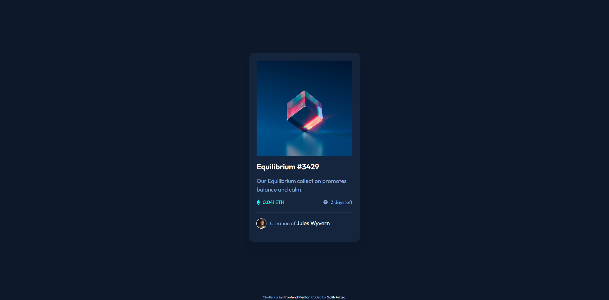

# Frontend Mentor - NFT preview card component solution

This is a solution to the [NFT preview card component challenge on Frontend Mentor](https://www.frontendmentor.io/challenges/nft-preview-card-component-SbdUL_w0U). Frontend Mentor challenges help you improve your coding skills by building realistic projects.

## Table of contents

- [Overview](#overview)
  - [The challenge](#the-challenge)
  - [Screenshot](#screenshot)
  - [Links](#links)
- [My process](#my-process)
  - [Built with](#built-with)
  - [What I learned](#what-i-learned)
  - [Continued development](#continued-development)
  - [Useful resources](#useful-resources)
- [Author](#author)
- [Acknowledgments](#acknowledgments)

## Overview

### The challenge

Users should be able to:

- View the optimal layout depending on their device's screen size
- See hover states for interactive elements

### Screenshot

### Links

- Solution URL: [https://github.com/chadittya/nft-preview-card-component-react/](https://github.com/chadittya/nft-preview-card-component-react)
- Live Site URL: [https://chadittya.github.io/nft-preview-card-component-react/](https://chadittya.github.io/nft-preview-card-component-react/)

## My process

### Built with

- Flexbox
- Desktop-first workflow
- [React](https://reactjs.org/) - JS library
- [Vite Js](https://vitejs.dev/) - React framework
- [Tailwind CSS](https://tailwindcss.com/) - For styles

### Useful resources

- [Box Shadow Generator](https://manuarora.in/boxshadows) - This helped me for generating box shadow for tailwind css that i used. I really liked this web and will use it going forward.
- [Example Overlay image Tailwind CSS](https://www.kindacode.com/snippet/tailwind-css-create-image-hover-overlay-effects/) - This is an amazing article which helped me finally understand how to build overlay in image with Tailwind CSS. I'd recommend it to anyone still learning this concept.

## Author

- Github - [chadittya](https://github.com/chadittya)
- Frontend Mentor - [@chadittya](https://www.frontendmentor.io/profile/chadittya)
- Twitter - [@galiharizza](https://www.twitter.com/galiharizza)
